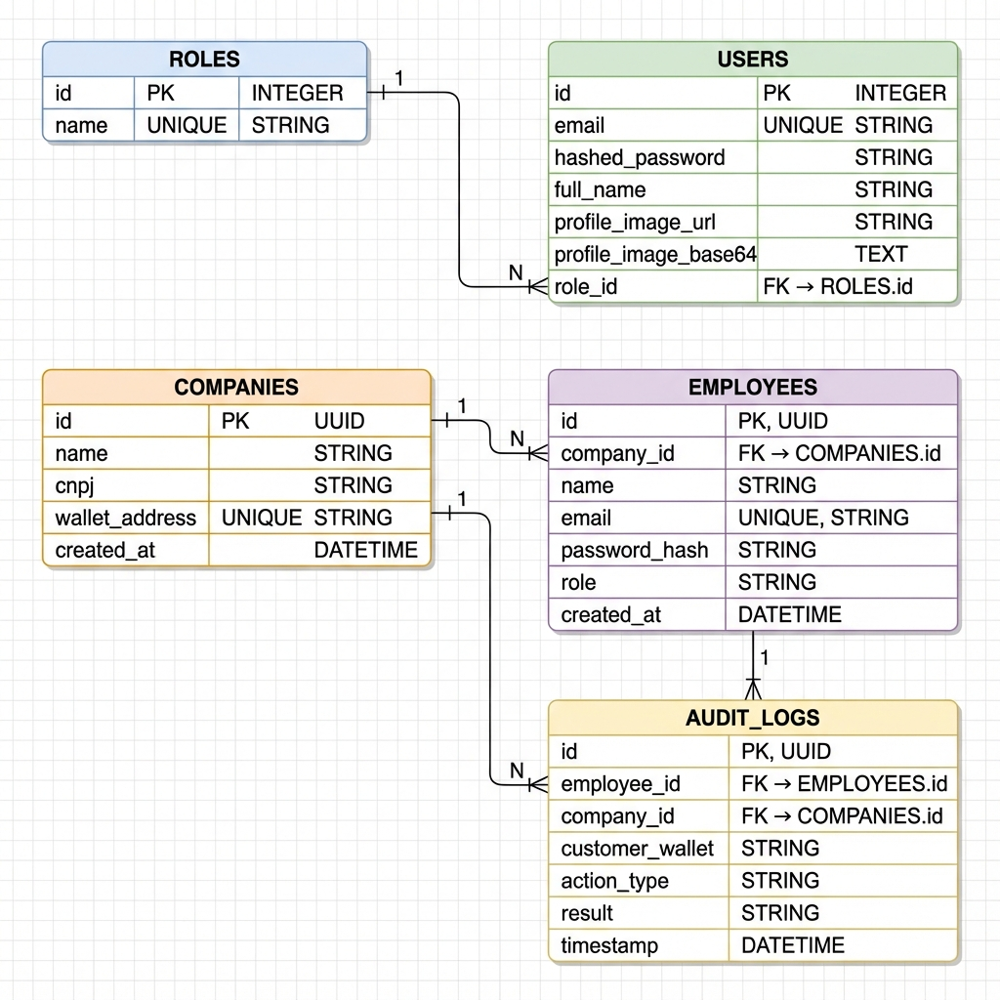

# Guia Rápido - Modelagem do Banco de Dados

## Diagrama Visual do Schema



---

## Resumo das Tabelas

### 👥 USERS (Clientes)
Usuários finais que cadastram dados na blockchain
- **PK**: `id` (INTEGER)
- **UK**: `email`
- **FK**: `role_id` → ROLES

### 🎭 ROLES (Perfis)
Perfis/papéis dos usuários
- **PK**: `id` (INTEGER)
- **UK**: `name`

### 🏢 COMPANIES (Empresas)
Empresas que solicitam acesso aos dados
- **PK**: `id` (UUID)
- **UK**: `wallet_address`
- Possui carteira blockchain

### 👔 EMPLOYEES (Funcionários)
Funcionários das empresas
- **PK**: `id` (UUID)
- **UK**: `email`
- **FK**: `company_id` → COMPANIES

### 📋 AUDIT_LOGS (Auditoria)
Logs de todas as ações no sistema
- **PK**: `id` (UUID)
- **FK**: `employee_id` → EMPLOYEES
- **FK**: `company_id` → COMPANIES

---

## Relacionamentos

```
ROLES (1) ──────→ (N) USERS
                      ↓
                   [role_id]

COMPANIES (1) ───→ (N) EMPLOYEES
    ↓                    ↓
    └──→ (N) AUDIT_LOGS ←┘
         [company_id]  [employee_id]
```

---

## Comandos Úteis

### Criar Todas as Tabelas

```python
from database import Base, engine
from users.user_model import User
from companies.company_model import Company
from employees.employee_model import Employee
from roles.role_model import Role
from audit_logs.audit_log_model import AuditLog

Base.metadata.create_all(bind=engine)
```

### Inserir Role Padrão

```python
from sqlalchemy.orm import Session
from database import SessionLocal
from roles.role_model import Role

db = SessionLocal()
role = Role(name="user")
db.add(role)
db.commit()
db.close()
```

### Consultar com Relacionamentos

```python
# Buscar usuário com role
user = db.query(User).filter(User.email == "user@example.com").first()
print(user.role.name)  # Acessa o role através do relacionamento

# Buscar funcionário com empresa
employee = db.query(Employee).filter(Employee.email == "emp@company.com").first()
print(employee.company.wallet_address)

# Buscar logs de auditoria com detalhes
logs = db.query(AuditLog).filter(AuditLog.company_id == company_id).all()
for log in logs:
    print(f"{log.employee.name} - {log.action_type} - {log.result}")
```

---

## Tipos de Dados

| Tipo SQLAlchemy | PostgreSQL | Uso |
|-----------------|------------|-----|
| `Integer` | INTEGER | IDs numéricos |
| `String` | VARCHAR | Textos curtos |
| `Text` | TEXT | Textos longos (Base64) |
| `UUID` | UUID | Identificadores únicos |
| `DateTime` | TIMESTAMP | Datas com timezone |

---

## Validações Pydantic

### Criação de Usuário
```python
{
    "email": "user@example.com",      # EmailStr validado
    "password": "senha123456",        # min 8 caracteres
    "full_name": "João Silva",        # min 3 caracteres
    "role_id": 1                      # obrigatório
}
```

### Criação de Empresa
```python
{
    "name": "Empresa XYZ",            # min 1 caractere
    "cnpj": "12.345.678/0001-90",     # opcional
    "wallet_address": "0x123..."      # min 10 caracteres
}
```

### Criação de Funcionário
```python
{
    "company_id": "uuid-da-empresa",
    "name": "Maria Santos",           # min 1 caractere
    "email": "maria@empresa.com",     # EmailStr validado
    "password": "senha123456",        # min 8 caracteres
    "role": "Analista"                # opcional
}
```

---

## Segurança

### ✅ Boas Práticas Implementadas

- ✓ Senhas com hash (bcrypt)
- ✓ Emails únicos
- ✓ Wallet addresses únicos
- ✓ Foreign keys com integridade referencial
- ✓ Índices para performance
- ✓ Timestamps com timezone
- ✓ UUIDs para distribuição

### ⚠️ Nunca Retornar

- `hashed_password` (Users)
- `password_hash` (Employees)

---

## Migrations

### Adicionar Nova Coluna

```python
from sqlalchemy import Column, String
from alembic import op

def upgrade():
    op.add_column('users', Column('phone', String, nullable=True))

def downgrade():
    op.drop_column('users', 'phone')
```

### Criar Índice

```python
from alembic import op

def upgrade():
    op.create_index('idx_users_full_name', 'users', ['full_name'])

def downgrade():
    op.drop_index('idx_users_full_name')
```

---

## Troubleshooting

### Erro: "relation does not exist"
**Solução**: Criar as tabelas
```python
Base.metadata.create_all(bind=engine)
```

### Erro: "duplicate key value violates unique constraint"
**Solução**: Email ou wallet_address já existe no banco

### Erro: "foreign key constraint fails"
**Solução**: Verificar se o registro referenciado existe
```python
# Verificar se role existe antes de criar user
role = db.query(Role).filter(Role.id == role_id).first()
if not role:
    raise ValueError("Role não encontrado")
```

---

## Documentação Completa

Para mais detalhes, consulte:
- [MODELAGEM_BANCO_DADOS.md](file:///c:/Users/Administrador/Desktop/Blockchain/Projeto%20V2/Back/MODELAGEM_BANCO_DADOS.md) - Documentação completa

---

## Checklist de Implementação

- [x] Modelo User com autenticação
- [x] Modelo Role para perfis
- [x] Modelo Company com wallet blockchain
- [x] Modelo Employee vinculado a empresas
- [x] Modelo AuditLog para rastreabilidade
- [x] Relacionamentos entre tabelas
- [x] Índices para performance
- [x] Validações Pydantic
- [x] Schemas públicos (sem senhas)
- [x] Integração com blockchain (wallet_address)

---

**Última atualização**: 2025-11-26
